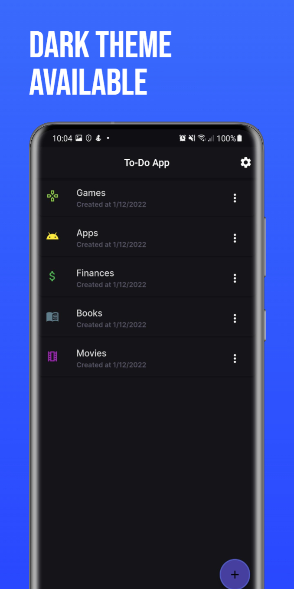

# todo-app
The classic to-do application where a user can write down all the things he wants to accomplish. Android only.

## Download
While it's not in Google's PlayStore, you can download it [here](https://github.com/samuel-s-marques/todo-app/releases).

## Table of Contents
- [todo-app](#todo-app)
  - [Download](#download)
  - [Table of Contents](#table-of-contents)
  - [Images](#images)
  - [Features](#features)
  - [To-Do](#to-do)
  - [My process](#my-process)
    - [Built with](#built-with)
    - [Packages I'm using](#packages-im-using)
  - [How to use](#how-to-use)
    - [Requirements](#requirements)
    - [Building](#building)
  - [Pull requests](#pull-requests)
  - [Created & Maintained By](#created--maintained-by)

## Images
<p>
    
    
    
    
</p>

## Features
- ✅ Multi-language (JA, PT, EN, ES...)
- ✅ Fast
- ✅ Dark mode
- ✅ Language selector
- ✅ Icon selector (for folders)
- ✅ Color selector (for folders)

## To-Do
- [ ] Change time format
- [ ] Check updates section in settings page
- [ ] Drag and drop folders and tasks
- [ ] Search folders and tasks
- [ ] Add more languages
- [ ] Add a reminder system

## My process
### Built with
- Flutter
- SQLite
- Shared Preferences

### Packages I'm using
- sliding_sheet: [link](https://pub.dev/packages/sliding_sheet)
- google_fonts: [link](https://pub.dev/packages/google_fonts)
- intl: [link](https://pub.dev/packages/intl)
- flutter_iconpicker: [link](https://pub.dev/packages/flutter_iconpicker)
- path_provider: [link](https://pub.dev/packages/path_provider)
- drift: [link](https://pub.dev/packages/drift)
- sqlite3_flutter_libs: [link](https://pub.dev/packages/sqlite3_flutter_libs)
- path: [link](https://pub.dev/packages/path)
- provider: [link](https://pub.dev/packages/provider)
- flutter_colorpicker: [link](https://pub.dev/packages/flutter_colorpicker)
- settings_ui: [link](https://pub.dev/packages/settings_ui)
- shared_preferences: [link](https://pub.dev/packages/shared_preferences)
- flutter_translate: [link](https://pub.dev/packages/flutter_translate)
- flutter_markdown: [link](https://pub.dev/packages/flutter_markdown)

## How to use
### Requirements
Before beginning, make sure you have installed [Flutter](https://docs.flutter.dev/get-started/install).

### Building
Clone the repo to your local computer
```
$ git clone https://github.com/samuel-s-marques/todo-app
```

Access the project's folder in your cmd/terminal
```
$ cd todo-app
```

Now you can open the project with VSCode or Android Studio and build it. Or you can use
```
$ flutter --no-color build apk --no-tree-shake-icons
```

## Pull requests
I welcome and encourage all pull requests. It usually will take me within 24-48 hours to respond to any issue or request.

## Created & Maintained By
[Samuel Marques](https://github.com/samuel-s-marques) ([LinkedIn](https://www.linkedin.com/in/samuel-s-marques/))

Mockups provided by [Previewed](https://previewed.app/template/CFA62417)

Icon provided by [FreeIconsPng](https://www.freeiconspng.com/img/5383)

Privacy policy and terms and conditions provided by [App privacy policy generator](https://app-privacy-policy-generator.firebaseapp.com/)